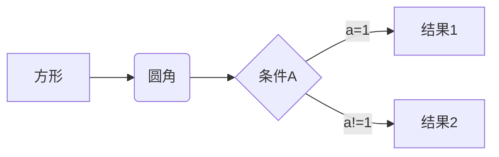
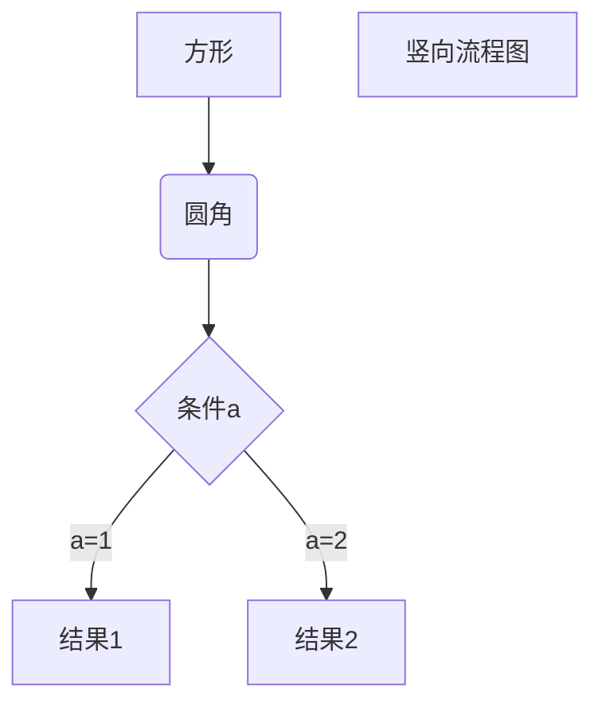

# Markdown yyds!!!

---


<!--more-->


# Hello World

----------------


#  一级标题

----------------------


## 二级标题

---


### 三级标题

---


#### 四级标题

---

*斜体文字*

_斜体文字_

**粗体文本**

__粗体文本__

***粗斜体文字***


---

<u>带下划线的文本</u>

---

创建脚注 [^ALEX]

[^ALEX]: 是兔子姐姐嗷!

---

* 第一项
* 第二项
* 第三项

1. 第一项
2. 第二项
3. 第三项

---

1. 第一项:
   - 第一项嵌套的第一个元素
   - 第一项嵌套的第二个元素
2. 第二项：
   - 第二项嵌套的第一个元素
   - 第二项嵌套的第二个元素

---

> 第一层嵌套
>
> > 第二层嵌套
> >
> > > 第三层嵌套

---

> 区块中使用列表：
>
> 1. 第一项
> 2. 第二项

---

* 第一项:

  > * 太强了
  > * Markdown真的好用

---

`printf()`函数

---

```java
System.out.println("Markdown NB!")
```

---

这是一个链接 [谷歌](https://www.google.com)

---

<https://www.baidu.com>

---

用1作为网址变量 [baidu][1]

用2作为网址变量 [google][2]


[1]: https://biadu.com
[2]: https://google.com


---


---


| Title 1 |      |      |      |
| ------- | ---- | ---- | ---- |
|         |      |      |      |

---

<kbd>Ctrl</kbd>+<kbd>Alt</kbd>+<kbd>Del</kbd>重启电脑

---

$$
X_1 = X_2^3+X_3^{5+1}
$$

---



---




---

```flow
st=>start: 开始框
op=>operation: 处理框
cond=>condition: 判断框(是或否?)
sub1=>subroutine: 子流程
io=>inputoutput: 输入输出框
e=>end: 结束框
st->op->cond
cond(yes)->io->e
cond(no)->sub1(right)->op
​```
```

---

