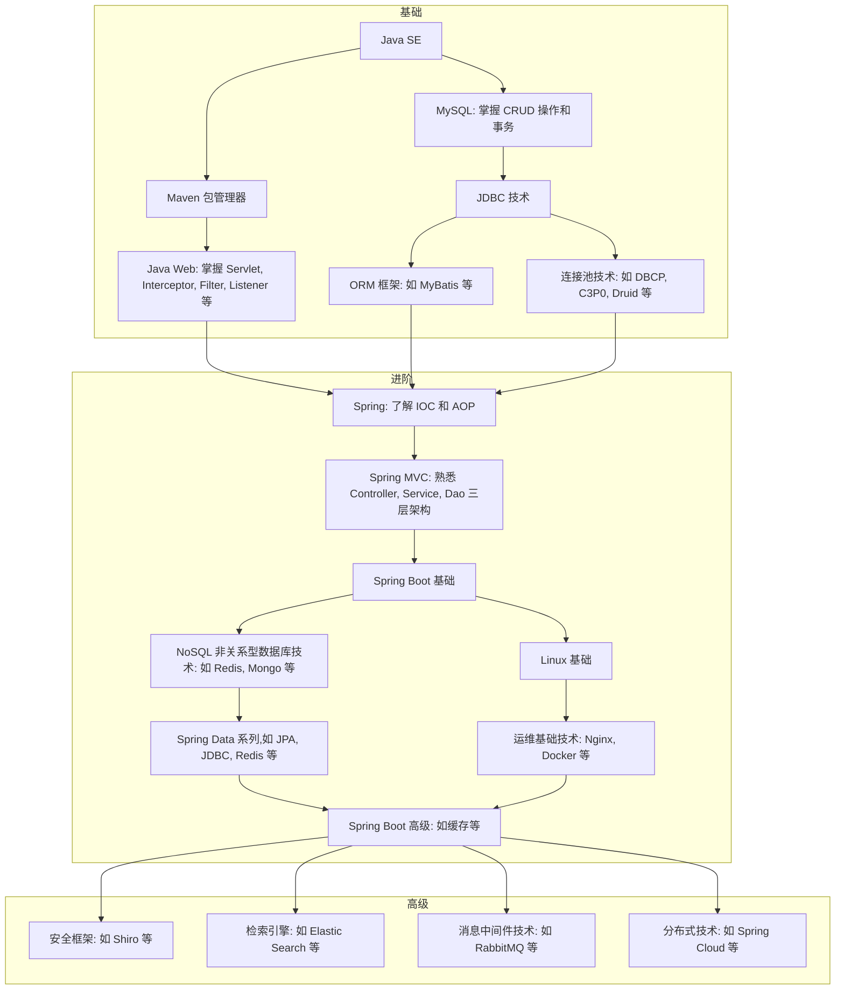

# 这里是关于后端的一个学习，来自冰姐姐！！！是一个完整的学习体系哦！！！

<!--more-->

```mermaid
graph TD

subgraph 基础
se[Java SE]
-->maven[Maven 包管理器]
-->web[Java Web: 掌握 Servlet, Interceptor, Filter, Listener 等]
se-->mysql[MySQL: 掌握 CRUD 操作和事务]
-->jdbc[JDBC 技术]
-->orm[ORM 框架: 如 MyBatis 等]
jdbc-->pool[连接池技术: 如 DBCP, C3P0, Druid 等]
end
subgraph 进阶
pool-->spring[Spring: 了解 IOC 和 AOP]
web-->spring
orm-->spring
-->mvc[Spring MVC: 熟悉 Controller, Service, Dao 三层架构]
-->boot[Spring Boot 基础]
-->nosql[NoSQL 非关系型数据库技术: 如 Redis, Mongo 等]
-->data[Spring Data 系列,如 JPA, JDBC, Redis 等]
boot-->linux[Linux 基础]
-->ops[运维基础技术: Nginx, Docker 等]
-->boot2[Spring Boot 高级: 如缓存等]
data-->boot2
end
subgraph 高级
boot2-->security[安全框架: 如 Shiro 等]
boot2-->es[检索引擎: 如 Elastic Search 等] 
boot2-->msg[消息中间件技术: 如 RabbitMQ 等]
boot2-->cloud[分布式技术: 如 Spring Cloud 等]
end
```

