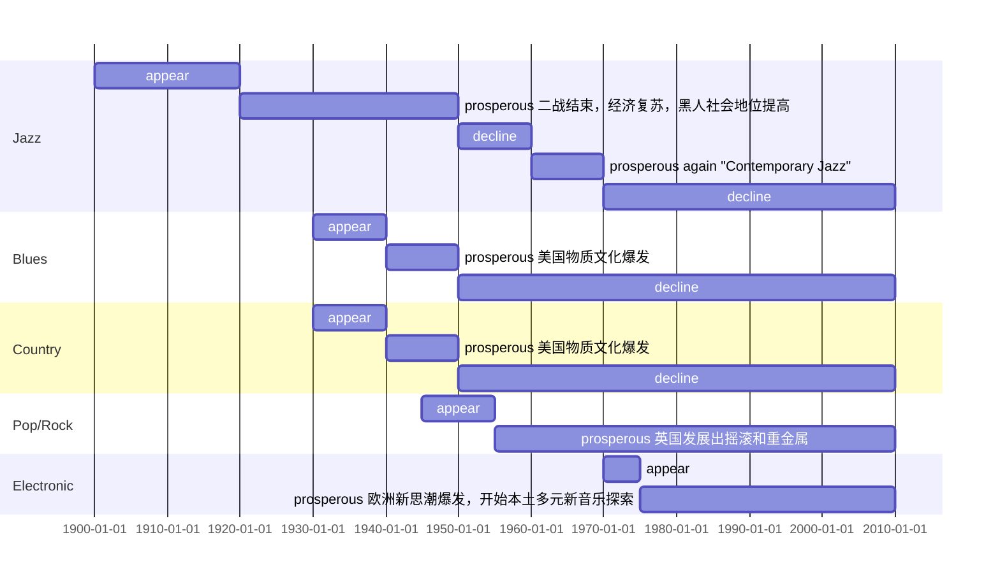

# 美赛模拟赛或正赛中的一个小模块~

---

<!--more-->

- 20世纪初，黑人音乐家融合“Jump Blues”发展出Jazz（爵士乐）
- 二战。40年代末至50年代初，战后社会复苏。黑人有了同白人一样的社会地位，Jazz兴盛
- 新一代年轻人融合Jazz、Blues的新音乐形式称为“Rock & Roll（摇滚乐）”
- 50 年代，美国物质文化爆发。文娱产品是个大买卖。新一代年轻人都喜欢融合Jazz、Blues的新音乐形式和这些音乐家，它变成了潮流，越来越多的出现在电台、电视，媒体为这种音乐起了个顺嘴又调侃的名字，叫它“Rock & Roll（摇滚乐）”，也就是Blues Rock（布鲁斯摇滚）
- 60年代初，大炮之后的新武器，唱片。British Blues Rock融合Folk小调和年轻俊脸流行美国，开始了“British Invasion（英式入侵）”，以及他们“爱”、“古着”。皮草、天鹅绒、厚底靴，美国有了Hippie（嬉皮），有了“新民谣复兴”
- Jazz学习“现代主义”，融合更多音乐形式与流派，进入“Contemporary Jazz（现代爵士）”
- 60 年代中期，彼岸的British Blues Rock衍生出Hard Rock（硬摇滚）、Galm Rock（华丽摇滚），踩着厚底靴、浓妆艳抹，扭着屁股华丽丽的造就了Heavy Metal（重金属）
- 60年代末英国流行音乐学习德国Kraut Rock、Avant-Prog发展出Art/Prog Rock（艺术摇滚）
- 70年代中期，纽约之后，欧洲新思潮爆发；虚无主义、宗教反思、体制崩溃、后工业时代、神秘主义…欧洲人开始了本土多元新音乐探索。欧洲Electronic原型全面应用到流行音乐。

