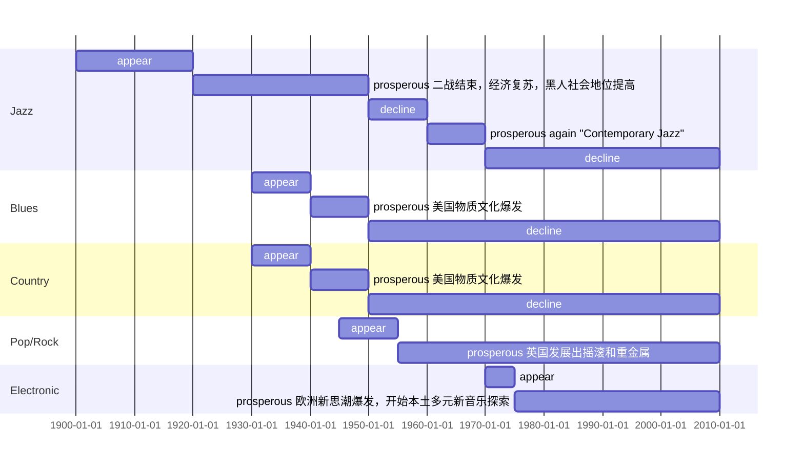

# 美赛模拟赛或正赛中的一个小模块~

---

<!--more-->

## 第六小问：

为了分析音乐类型随着时间推移所发生的改变和变化，我们对于1930年到2010年每十年音乐影响力的情况进行了分析。仍然采用的论文上述$PageRank$模型，我们按照九个不同的时间点，根据九个时间点下的数据，构造了九个描述音乐影响力的网络和相对应的矩阵。通过$PageRank$求得了不同音乐类型在特定年份下的影响力。

20种音乐类型的影响力随着年份的变化关系，我们在一张图中集中画出，使得对比更加明显。同时，根据音乐的影响力，在同样的时间条件下，我们绘制了不同音乐类型的排名。随着时间从1930年向2010年推移，不同音乐类型的排名情况也在发生改变。上述两图分别为下面的图一和图二：

图一

图二

我们Pop/Rock这种音乐类型进行分析，从影响力随着时间的变化来看。Pop/Rock的影响力随着时间推移迅速增加。十分具有特点和个性，我们针对于他进行详细分析。

对于Pop/Rock来说，随着时间推移，其影响力一直上涨，在1960年到1970年的增长速度最快，最终影响力达到了峰值1 , 并且一直稳定在1。相比之下 ,  Jazz的影响力则从1950到1960年快速下降 , Pop/Rock在这重要的1950-1970这20年间, 迅速超越Jazz霸榜  . 

**下面是第六题第一小问要增加的内容**

用到之前的演化图

根据流程演变图，很明显的发现，Pop/Rock的诞生经历过了Jazz音乐革命后，R&B和Latin的新生，再由R&B和Latin的音乐革命后发展而来的。集合了这两者的特点并具有自己个性的Pop/Rock，很快收到了人们的喜欢，在1950-1970年的音乐革命中，吸引了大量的目光。这使得Jazz这门鼻祖的影响力逐渐下降，对于Jazz的热度产生了直接的影响。同时，Pop/Rock在自身革命的过程中，也在逐渐的演化分化，对于Electronic和International这两种音乐类型的发展产生了深远的影响，对于它们的新生做出了卓越的贡献。可见，音乐之间的通过音乐革命相互影响的关系。

**上面是要增加的内容**

我们也看到，在图二中，随着影响力的上涨，Pop/Rock的排名最终稳定在了一，非常像1930年代的Jazz。其热度一直保持到了今天，可见，Pop/Rock被一代又一代人所认可，对我们国家的文化发展造成了深远的影响。我们可以预测，在不远的将来，就算Pop/Rock的影响力被新的音乐形式所取代，其影响力依旧可以保持许久，就像Jazz那样 , 及时影响力下降 , 排名也依旧很高 。对我们国家产生深远影响的音乐类型，都将会被我们中的很多人喜爱和传承，并且拥有持久的生命力。

**这里是新加入的内容！！！**（第六小题第二问）

这一块儿要用到热榜哦，和前面是对应趋势总体分析，这里是对于一种音乐流派分析，其实可以整合在一起。

1940年的时候，很显然排名榜上影响最大的音乐家为Jazz，并且Jazz占据了榜前十的半数席位，足以体现其在1940年的统治力。但从1950年开始到1970，十分明显Pop/Rock开始野蛮生长，与之同时流行的是R&B;。这几十年的变化中，热度前十完全没有Jazz的位置。虽然从1960年开始，Pop/Rock的地位被其他一些音乐类型挑战，但其仍然以绝对的优势，占据了榜单大部分的席位。我们同时对于这些音乐家进行了id统计，把相应的id也记在上述表格中（仅展示榜首）。一个有趣的结论被我们发现，每年榜首上的音乐家都不尽相同。但是也有很多相同点，榜首上的音乐家，往往代表了发展迅猛的音乐类型。对于音乐家来说，他们在成为音乐家之前，会收到当时音乐环境的影响。新型的音乐，影响力更大的音乐类型，往往会吸引更多的追随者，并促使他们中的优秀者，逐渐成为自己音乐类型的代表音乐家。简单来说，前十年的音乐环境和音乐发展的趋势，一定程度上会影响，十年所诞生的音乐家的派别。而这些艺术家，又将创造属于自己的作品，在自己的风云年代，去影响更多的人并完善自己音乐类型的音乐文化，促使音乐类型的影响力增长，这些音乐类型文化又将催生出下一批音乐家。这便是音乐类型和音乐家是如何随着时间的推移，相互影响，共同发展的结论。

**这儿主要介绍的是音乐家和音乐类型随着时间的演变，要借助到流派进行分析，感觉和流派那一块儿有点重，向姐姐康康怎么串起来嗷！**

## 第七小问：

为了探索音乐在时间或环境中的文化影响，我们结合分析得到的音乐影响力变化数据（上两图）。同时我们按照不同的时间点，分析当时的历史大背景和音乐界的重大事件，统计后绘制出了如下甘特图：

图三

- 20世纪初，音乐家融合"Jump Blues"发展出了Jazz，在后续的几十年内，Jazz蓬勃发展，二战后40年代末至50年代初，战后社会复苏，Jazz兴盛并占据主流。同时，单曲发行量也在1940-1950年达到的最高峰。体现了二战后，社会繁荣发展的状态。很可惜的是，Jazz数据的年份是从1930年开始的，无法对于Jazz的历程做一个整体描述，但我们依然可以从图二发现，1930年的时候，Jazz的音乐影响力是最大，的并且和其他音乐相差很多，一直到1950年，都是影响力最大的音乐。和我们的分析相符合。
- 1930年后，新一代年轻人融合Jazz、Blues的新音乐形式称为“Rock & Roll（摇滚乐）”。50 年代，物质文化爆发。文娱产品是个大买卖。新一代年轻人都喜欢融合Jazz、Blues的新音乐形式和这些音乐家，它变成了潮流，越来越多的出现在电台、电视，媒体为这种音乐起了个顺嘴又调侃的名字，叫它“Rock & Roll（摇滚乐）”，也就是Blues Rock（布鲁斯摇滚），摇滚逐渐变得流行。从图一中我们可以看出，摇滚乐从出生开始，其实就一直高歌猛进，影响力迅速提高，并在1960年以后，死死占领了影响力的榜首，并与其他类型歌曲的影响力差距十分大，体现出了深受人喜爱，持久性强等特点。同时，Jazz和Blues等音乐，在发展过程中，则逐渐没落，影响力下降，被融合了二者特定的摇滚乐所取代。新的受欢迎的音乐的地位会逐渐赶超旧音乐的地位，这是音乐的发展趋势，从我们的图中也可以直观反应出这个结论。
- 60年代初，唱片出现。British Blues Rock融合Folk小调和年轻俊脸流行美国，开始了“British Invasion（英式入侵）”，以及他们“爱”、“古着”。皮草、天鹅绒、厚底靴，美国有了Hippie（嬉皮），有了“新民谣复兴”。在我们的图一中，我们发现这一时代，`comedy/spoker`的影响力迅速提高。
- 70年代中期，纽约之后，欧洲新思潮爆发；虚无主义、宗教反思、体制崩溃、后工业时代、神秘主义…欧洲人开始了本土多元新音乐探索。欧洲Electronic原型全面应用到流行音乐。我们从图一中可以发现，Electronic自1960年开始，影响力便快速上升，和我们的拟合一致。

经过上述分析，我们发现了许多特点。例如，二战后单曲总量急速上升，摇滚乐影响力直线上升等。体现了，社会环境会对于音乐发展有较大的影响。类似于二战后，社会开始繁荣昌盛，迅速发展时，音乐和与之对应的音乐文化也被鼓舞和促进，迅速发展。同时，随着音乐的发展，类似于朋克文化等音乐文化逐渐发展盛行，有反过来对于社会发展产生了影响。总的来说，音乐和环境相互影响，呈正相关关系，好的社会环境促生音乐类型的更新迭代，而音乐类型经过更新迭代产生的新的音乐文化，又促进了社会层面思想上的进步，推动社会继续发展。我们应该重视音乐发展，也应该重视音乐发展的社会环境，这样才有利于我们社会和音乐文化的整体发展。

# 这儿是新加上的：

**下面这里是第七题第二问，感觉可以整合进第五问里面，向姐姐康康怎么串起来比较好**

整合到

这个地方

同时，社会、政治或技术变革(如互联网)的影响也可以被我们从网络中捕捉出来。我们可以通过这些影响发生的时间段和这些影响自身的特点，分析这个时间段前后，音乐影响力的改变，热榜的变化，取帮助我们从网络中提取出所谓的影响。

我们举个例子进行分析，取互联网的影响进行分析。我们首先根据互联网爆发的年代，从网络中挑选出其之前之后年份中，变化较大的音乐类型。根据我们的影响力随着时间的变化图和排名随着时间的变化图，我们发现电子音乐在这些年间有一个长足的增长。我们认为，我们网络中电子音乐的变化就可以识别互联网的影响，因为电子音乐有一种非常重要的创作形式是通过电脑来创作的，互联网的普及带来了电脑的普及，这给予了很多电子音乐家更多创作作品的机会，一定程度上带来了电子音乐的增长。网络内这些社会、政治或技术的影响的识别，我们团队就是通过这种方式来实现的。